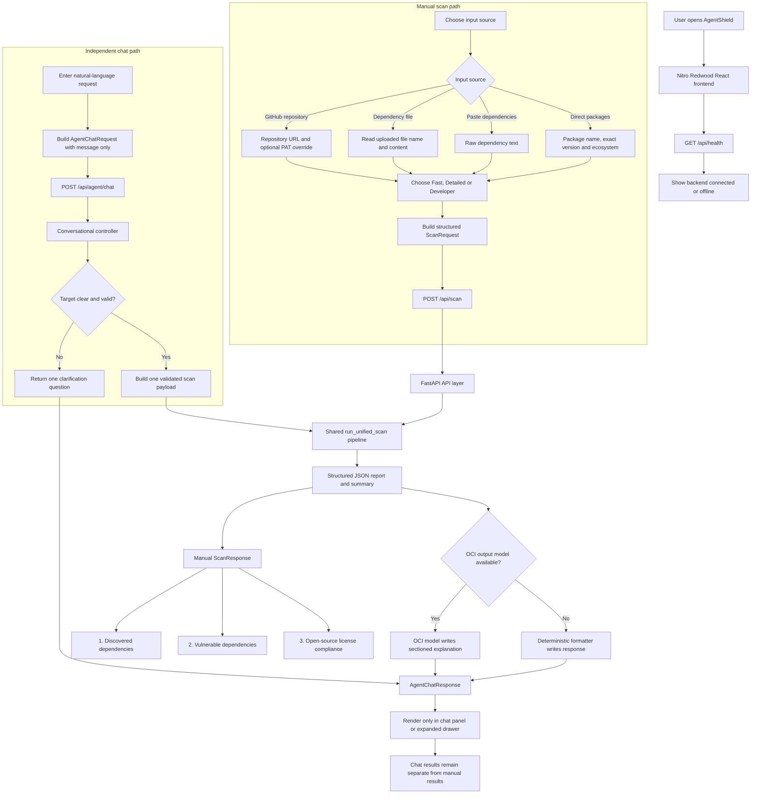
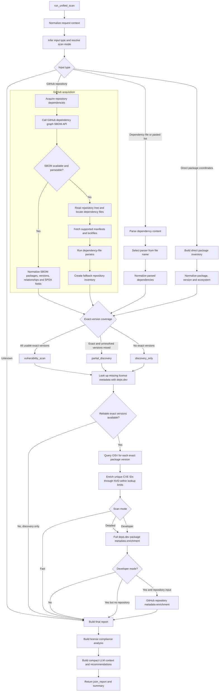
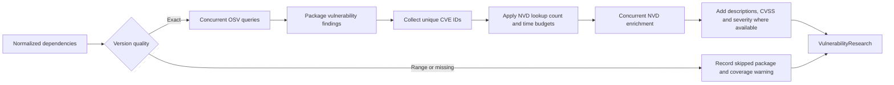
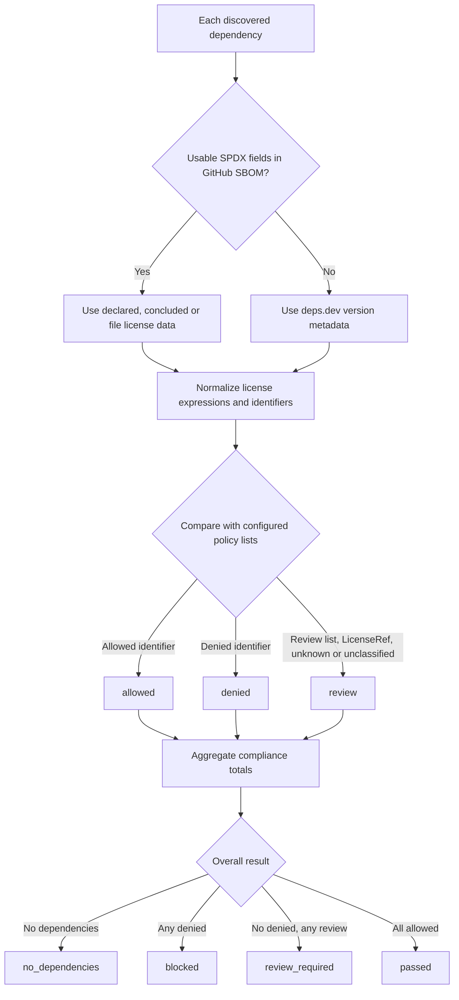
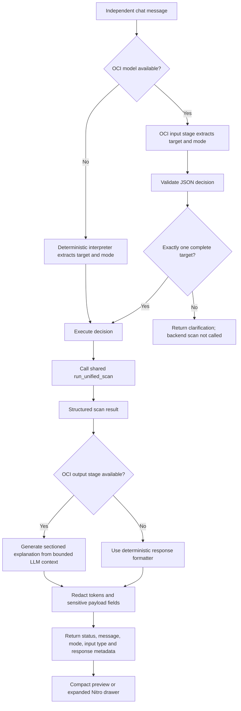
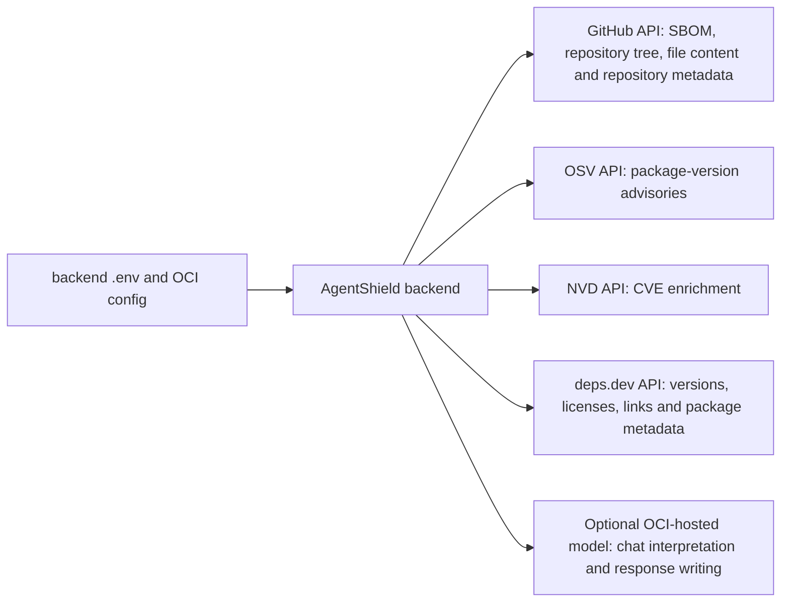

# AgentShield application flow

This document describes the current integrated application in `agent-shield-app`.
The manual scan and conversational agent are separate user experiences, but both
reuse the same backend scan pipeline.

## 1. Complete end-to-end flow

Important separation:

- A manual scan updates the inventory, vulnerability and license tables.
- A chat scan stays inside the chat panel and expanded drawer.
- Chat does not read or replace the manual form or manual table results.

## 2. Shared backend scan pipeline

### Supported dependency-file parsing

The parser layer recognizes the supported file names and routes their content to
the corresponding parser. Current examples include:

- Python: `requirements.txt`, `pyproject.toml`, `poetry.lock`, `Pipfile.lock`
- JavaScript/npm: `package.json`, `package-lock.json`
- Maven: `pom.xml`
- Conda: `environment.yml`, `environment.yaml`, and Conda lock-file variants

Every parsed package is normalized to a common dependency model containing its
name, version, version quality, ecosystem, source type, relationship and file path.

## 3. Vulnerability flow

The system does not claim that an unresolved dependency is safe. Missing or
range versions are reported as incomplete coverage, and an inventory with no
exact versions becomes `discovery_only`.

## 4. License-compliance flow

The allow, review and deny lists come from backend environment configuration.
The result is an engineering policy signal and not a legal opinion.

## 5. Conversational-agent flow

Mode inference for chat:

- `fast` for a normal vulnerability or CVE check
- `detailed` when the user asks for licenses, metadata, trust or package health
- `developer` when the user asks for deeper engineering or repository context
- An explicitly supplied mode wins over model inference

## 6. What changes by mode

| Stage | Fast | Detailed | Developer |
|---|---:|---:|---:|
| Dependency discovery and normalization | Yes | Yes | Yes |
| License metadata lookup and compliance | Yes | Yes | Yes |
| Exact-version OSV matching | Yes | Yes | Yes |
| NVD enrichment | Yes | Yes | Yes |
| Full deps.dev metadata enrichment | No | Yes | Yes |
| GitHub repository metadata enrichment | No | No | Yes, for repository input |
| Developer/provider-plan details | No | No | Yes |

## 7. Final report and UI mapping

`format_output_node` returns two top-level values:

- `json_report`: structured data used by the frontend
- `summary`: short scan completion summary

The manual frontend maps the report in this order:

1. **Discovered dependencies** — normalized inventory and version quality
2. **Vulnerable dependencies** — exact-version findings, severity and IDs
3. **Open-source license compliance** — detected license, policy status and source

Additional summary cards show dependency count, exact-version count, packages
checked and unique CVE count. Discovery-only and partial-discovery warnings are
shown explicitly above the tables.

## 8. External systems and configuration

Relevant configuration includes the default GitHub token, optional NVD key,
OCI model configuration, CORS/backend settings, provider limits and the license
allow/review/deny lists. Secrets stay in `backend/.env` or the local OCI config
and must not be included when sharing the application.

## 9. Short presentation script

1. The user chooses a repository, dependency file, pasted list or direct package.
2. The frontend sends a structured request to FastAPI.
3. The backend normalizes the request and creates a common dependency inventory.
4. Repository scans try GitHub SBOM first and fall back to parsing repository files.
5. License metadata is taken from SBOM SPDX fields or deps.dev and checked against policy.
6. Only exact package versions are sent to OSV; CVE IDs are enriched through NVD.
7. Detailed mode adds full deps.dev metadata, while Developer mode also adds GitHub context.
8. The backend returns one structured report for inventory, security and compliance tables.
9. Chat is an independent interface that interprets natural language and reuses the same scan pipeline without changing manual results.

## 10. Main implementation files

- Frontend orchestration: `frontend/src/components/AgentShieldWorkspace.tsx`
- Frontend API client: `frontend/src/api/agentShieldApi.ts`
- FastAPI routes: `backend/app/main.py`
- Unified LangGraph workflow: `backend/app/agents/unified_scan_agent.py`
- GitHub SBOM and file fallback: `backend/app/services/github/acquisition.py`
- File parsing: `backend/app/parsers/dependency_parsers.py`
- Vulnerability research: `backend/app/services/vulnerability/research.py`
- deps.dev enrichment: `backend/app/services/enrichment/deps_dev.py`
- License compliance: `backend/app/services/license_analysis.py`
- Report and LLM context: `backend/app/services/reporting.py`
- Chat controller: `backend/app/controller/chat_controller.py`
